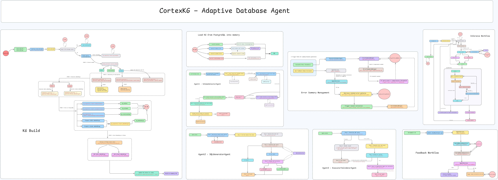

# CortexKG — Adaptive Database Agent

> A production-grade multi-agent text-to-SQL system built on a custom knowledge graph. CortexKG learns from mistakes, adapts to your schema, and gets smarter with every query.

---

## Blog Series

| Part | Title | Link |
|------|-------|------|
| Part 1 | Building an Adaptive Database Agent: CortexKG — A Multi-Agent System That Learns from Mistakes | https://medium.com/@govindarajpriyanthan/building-an-adaptive-database-agent-cortexkg-a-multi-agent-system-that-learns-from-mistakes-32f183329cfd |
| Part 2 | CortexKG — Part 2 | https://medium.com/@govindarajpriyanthan/building-an-adaptive-database-agent-cortexkg-a-multi-agent-system-that-learns-from-mistakes-part-c292c14f43f9 |
| Part 3 | CortexKG — Part 3 | https://medium.com/@govindarajpriyanthan/building-an-adaptive-database-agent-cortexkg-a-multi-agent-system-that-learns-from-mistakes-f899d31b8eae |
| Part 4 | *(Coming soon)* | — |
| Part 5 | *(Coming soon)* | — |
| Part 6 | *(Coming soon)* | — |
| Part 7 | *(Coming soon)* | — |
| Part 8 | *(Coming soon)* | — |

---

## System Architecture


The diagram above shows the full system: **KG Build**, **Load KG from PostgreSQL into memory**, **Agent 1 (SchemaSelectorAgent)**, **Agent 2 (SQLGeneratorAgent)**, **Agent 3 (ExecutorValidatorAgent)**, **Error Summary Management**, **Inference Workflow**, and **Feedback Workflow** — all orchestrated by a LangGraph state machine.

---

## What It Does

CortexKG converts natural language questions into accurate SQL queries against any PostgreSQL database. Unlike conventional text-to-SQL agents that treat every query in isolation, CortexKG:

- **Builds a Knowledge Graph** of your database schema — tables, columns, relationships, embeddings, and AI-generated descriptions — stored in PostgreSQL and Chroma.
- **Learns from errors** — when a query fails, it extracts a lesson and adds it to a compressed error summary that persists across sessions.
- **Learns from feedback** — negative user ratings and comments trigger lesson extraction via LLM, refining future SQL generation.
- **Clarifies ambiguity** — a two-phase clarification mechanism (pre-schema and post-schema) catches genuine ambiguities without over-interrupting clear queries.
- **Routes errors intelligently** — failed executions are classified and routed back to the correct agent (schema re-selection or SQL re-generation) with context from the error history.

---

## Core Components

### Knowledge Graph Build
Extracts schema metadata (tables, columns, FK relationships) from the source PostgreSQL database. Generates AI descriptions and embeddings via OpenAI. Stores structured data in `kg_storage_db` (PostgreSQL) and vectors in Chroma.

### KG Storage (PostgreSQL)
Seven Alembic-managed tables:
- `kg_metadata` — one row per knowledge graph, keyed by a SHA-256 hash of the source DB connection
- `kg_tables` — table-level metadata with AI-generated descriptions and business domain classification
- `kg_columns` — column-level metadata including PII flags, cardinality, sample values, and enum values
- `kg_relationships` — FK relationships with join conditions and relationship type
- `kg_embeddings` — raw embedding vectors (bytea) for tables and columns, used to reload Chroma on restart
- `kg_query_log` — every query attempt: SQL, result, error, timing, pgvector embedding for semantic search
- `query_error_patterns` — recurring error patterns with occurrence counts and fixes applied
- `kg_error_summary` — compressed lesson summaries (schema lessons + SQL lessons) per KG, auto-compressed when word count exceeds threshold

### Agent 1 — SchemaSelectorAgent
1. Embeds the user query and runs vector similarity search against Chroma to find candidate tables.
2. LLM filtering (GPT-4o) selects the minimum set of relevant tables with chain-of-thought reasoning.
3. Graph traversal finds bridging tables (to connect selected tables via FK paths) and enrichment tables (to resolve FK IDs to human-readable names).
4. Loads full table contexts (columns, relationships, sample values) for all final tables.
5. Schema lessons from `kg_error_summary` are injected into the LLM prompt.

### Phase B — Schema-Aware Clarification
After Agent 1 selects tables, the ClarificationTool validates every user-referenced entity against the actual schema. Auto-resolves synonyms and naming differences. Only asks the user when there are genuinely multiple valid candidates.

### Agent 2 — SQLGeneratorAgent
1. Retrieves similar past successful queries via pgvector semantic search (few-shot examples).
2. SQL lessons from `kg_error_summary` are injected into the system prompt.
3. GPT-4o generates SQL with chain-of-thought reasoning.
4. SQLValidationTool performs structural validation; self-correction is attempted if validation fails.

### Agent 3 — ExecutorValidatorAgent
1. Executes SQL against the source database with a configurable timeout and row limit.
2. On failure: classifies the error (GPT-4o), routes to Agent 1 or Agent 2 for correction, stores the error pattern.
3. On retry success: extracts a lesson from the error/fix pair and appends it to `kg_error_summary`.
4. Stores every attempt in `kg_query_log` with the query embedding, timing, and metadata.

### Error Summary Manager
Maintains a two-category lesson store per KG (`schema_lessons`, `sql_lessons`). Each lesson is a concise rule (≤30 words) extracted by LLM from errors or feedback. When word count exceeds a threshold (default 500 words), background async compression merges similar rules into generalised principles, targeting 50% reduction.

### Feedback Workflow
User feedback (thumbs up/down, text, rating) is stored against the query log. Negative feedback triggers LLM-based lesson extraction. The LLM decides whether the root cause is a schema selection error or an SQL logic error and writes the appropriate lesson into `kg_error_summary`.

---

## Tech Stack

| Layer | Technology |
|-------|-----------|
| Orchestration | LangGraph (StateGraph) |
| LLM | OpenAI GPT-4o / GPT-4o-mini |
| Embeddings | OpenAI text-embedding-3-small (1536d) |
| KG Storage | PostgreSQL + pgvector |
| Vector Search | Chroma (persistent) + pgvector (fallback) |
| Observability | Langfuse |
| Migrations | Alembic |
| UI | Streamlit |
| DB Driver | psycopg2 |
| Validation | Pydantic v2, sqlparse |

---

## Project Structure

```
.
├── app.py                          # Streamlit UI
├── main.py                         # Public API layer (connect, build, query, feedback)
├── config/
│   └── settings.py                 # Pydantic settings from .env
├── alembic/                        # Database migrations
│   └── versions/                   # 7 migration files
├── src/
│   ├── agents/
│   │   ├── schema_selector_agent.py
│   │   ├── sql_generator_agent.py
│   │   ├── executor_validator_agent.py
│   │   └── tools/
│   │       ├── vector_search_tool.py
│   │       ├── llm_filter_tool.py
│   │       ├── graph_traversal_tool.py
│   │       ├── sql_validation_tool.py
│   │       ├── query_memory_tool.py
│   │       └── clarification_tool.py
│   ├── kg/
│   │   ├── builders/kg_builder.py
│   │   ├── extractors/             # Schema, table, column, relationship extractors
│   │   ├── generators/             # Description + embedding generators
│   │   ├── manager/kg_manager.py
│   │   ├── models/                 # Pydantic models: KG, Table, Column, Relationship
│   │   └── storage/                # KGRepository (PostgreSQL) + VectorStore (Chroma)
│   ├── memory/
│   │   ├── query_memory_repository.py
│   │   └── error_summary_manager.py
│   ├── orchestration/
│   │   ├── agent_state.py          # LangGraph AgentState
│   │   ├── workflow_graph.py       # LangGraph StateGraph
│   │   └── error_router.py
│   ├── api/
│   │   └── agent_service.py        # Top-level service: query(), submit_feedback()
│   └── openai_client.py
```

---

## Setup

### Prerequisites
- Python 3.11+
- PostgreSQL with pgvector extension
- OpenAI API key
- Langfuse account (optional, for observability)

### Environment Variables

```env
# KG Storage Database
KG_USER=postgres
KG_PASSWORD=your_password
KG_HOST=localhost
KG_PORT=5432
KG_DATABASE=kg_storage_db

# OpenAI
OPENAI_API_KEY=sk-...

# Langfuse (optional)
LANGFUSE_PUBLIC_KEY=pk-lf-...
LANGFUSE_SECRET_KEY=sk-lf-...
LANGFUSE_HOST=https://cloud.langfuse.com

# Chroma
CHROMA_PERSIST_DIR=./chroma_db
```

### Install & Migrate

```bash

# Run Alembic migrations against kg_storage_db
alembic upgrade head

# Launch the Streamlit UI
streamlit run app.py
```

---

## How a Query Flows

```
User Question
     │
     ▼
Phase A: Intent check (pre-schema)
     │  — only halts if query is too vague to start table selection
     ▼
Agent 1: SchemaSelectorAgent
     │  vector search → LLM filter → graph traversal → load contexts
     ▼
Phase B: Schema-aware clarification
     │  — auto-resolves synonyms, only asks user for genuine multi-match ambiguity
     ▼
Agent 2: SQLGeneratorAgent
     │  few-shot retrieval → SQL lessons injection → GPT-4o generation → validation
     ▼
Agent 3: ExecutorValidatorAgent
     │  execute → classify error → route back to Agent 1 or 2 (up to 3 retries)
     │  on retry success → extract lesson → store in kg_error_summary
     ▼
Response + store query log
     │
     ▼
User Feedback (optional)
     └─ lesson extraction → kg_error_summary
```

---

## Key Design Decisions

- **pgvector for semantic query memory** — similar past queries are retrieved at generation time as few-shot examples, giving Agent 2 concrete SQL patterns to follow.
- **Chroma backed by PostgreSQL** — embeddings are stored in both Chroma (fast search) and PostgreSQL (durable). On restart, if Chroma is empty, embeddings are reloaded from PostgreSQL automatically.
- **Compressed lesson store** — rather than replaying a full error log, lessons are distilled into concise numbered rules and compressed asynchronously when they grow too large.
- **Explicit rollback before every query** — psycopg2 requires an explicit rollback after any failed transaction before the connection can be reused.
- **`@observe` with in-method Langfuse instantiation** — the Langfuse client is instantiated inside each `@observe`-decorated method to correctly access thread-local trace context.
- **Timestamp-prefixed Alembic migrations** — migration files use `YYYY_MM_DD_HHMM-` prefixes for unambiguous ordering.
